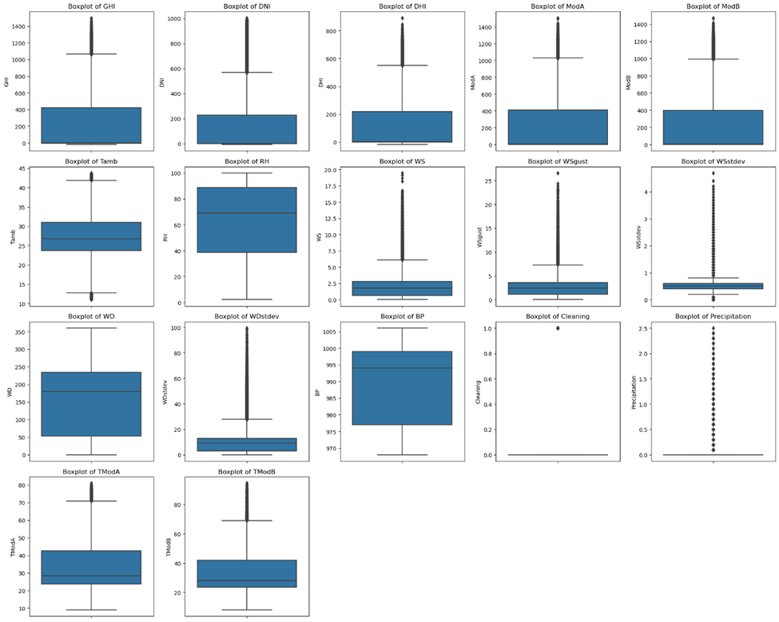
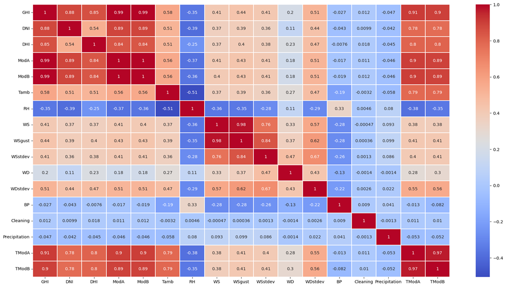
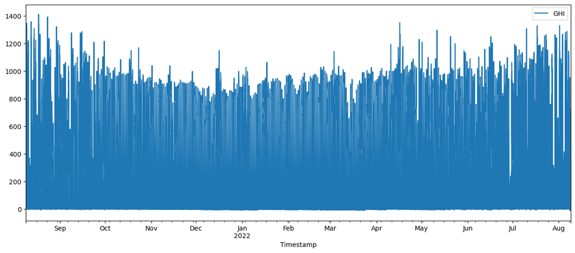
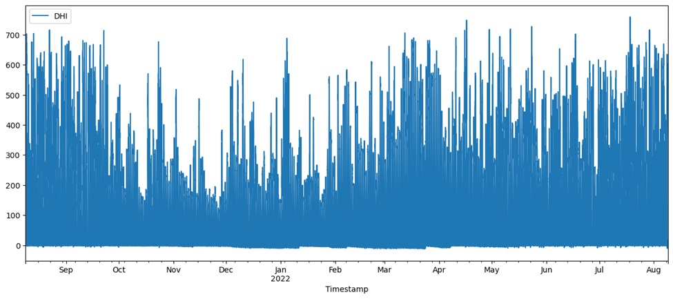
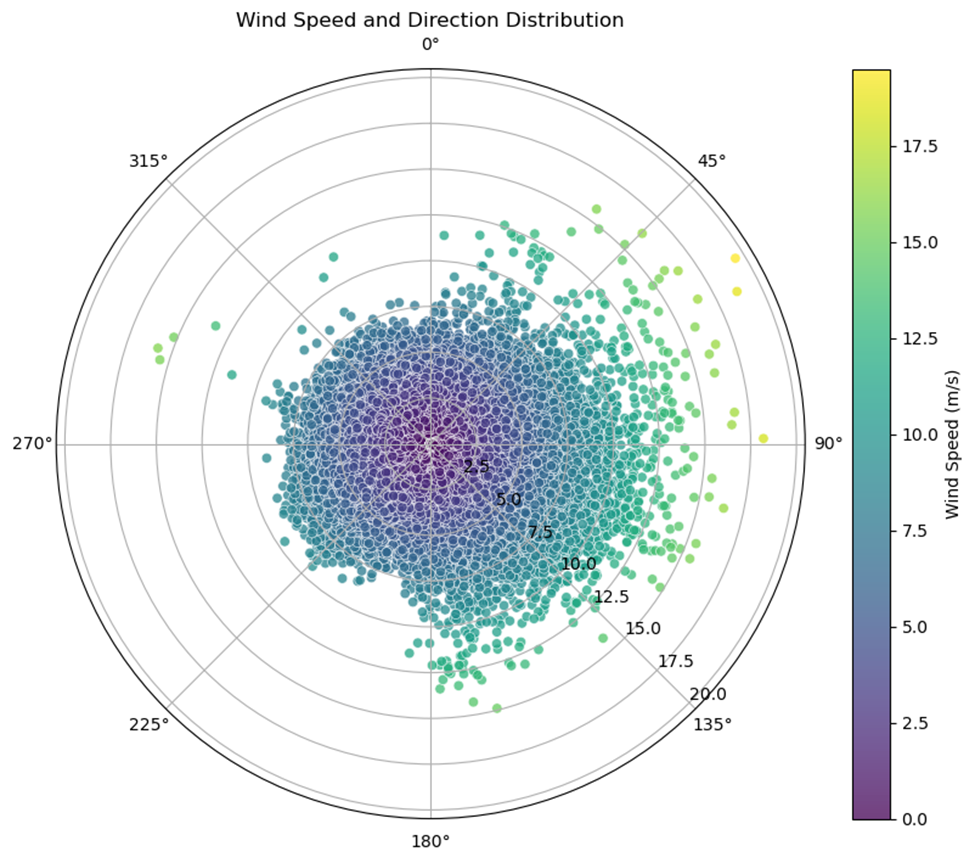
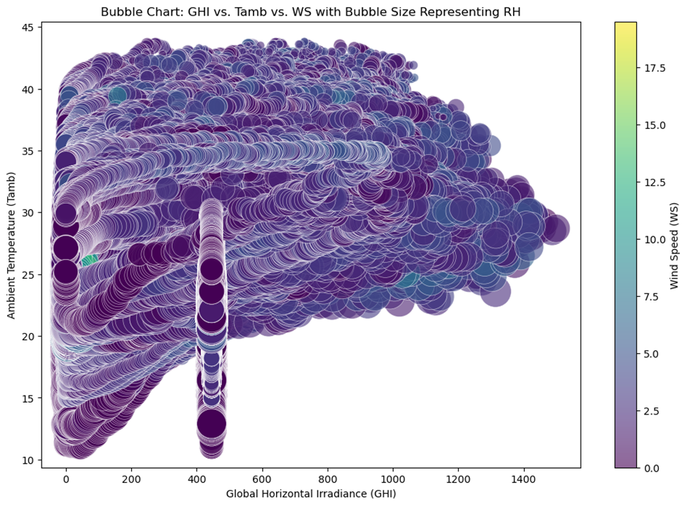

# Solar Radiation Data Analysis

Introduction

In the context of renewable energy, particularly solar power, the accurate assessment and monitoring of various environmental and meteorological factors are crucial for optimizing energy production and maintaining system efficiency. This report presents a comprehensive analysis of a dataset containing key parameters that influence solar irradiance and the performance of photovoltaic systems.

The dataset includes a variety of features such as Global Horizontal Irradiance (GHI), Direct Normal Irradiance (DNI), and Diffuse Horizontal Irradiance (DHI), which are essential for understanding the amount and distribution of solar energy available at a specific location. Additionally, measurements from two modules or sensors (ModA and ModB) provide further insight into the performance of specific components within the system.

Environmental variables such as ambient temperature (Tamb), relative humidity (RH), wind speed (WS), and barometric pressure (BP) are also included, as these factors significantly impact the efficiency of solar panels and other related equipment. The dataset further contains information on the cleaning status of the modules, precipitation rates, and detailed temperature measurements for the modules, all of which contribute to the overall performance analysis.

The primary objectives of this analysis are to explore the relationships between these variables, identify patterns that could influence solar energy generation, and provide actionable insights for optimizing system performance. The scope of this report includes data preprocessing, exploratory data analysis, and the application of statistical methods. By addressing these objectives, the report aims to contribute valuable insight for improving the reliability and efficiency of solar power systems.

Methodology
The analysis of the dataset was conducted using a systematic approach that included data preprocessing, exploratory data analysis (EDA), and the application of various statistical techniques. This section provides a detailed description of the methodology used to achieve the objectives of the analysis.

1. Data Preprocessing
Before conducting the analysis, several preprocessing steps were undertaken to ensure the dataset was clean, consistent, and ready for analysis including data integration of different datasets. 

Handling Missing Values: The dataset was examined for missing or incomplete data. Depending on the extent and nature of the missing values, appropriate strategies such as imputation (mean) or removal of columns with excessive missing data were applied.

Data Cleaning: Non-numeric fields like the 'timestamp' column were reviewed to identify any entries that might affect the analysis. Irrelevant anomalies (outliers) were detected and  corrected standardization. 

Feature Engineering: New features were derived from the existing ones to enhance the analysis. For instance, the ratio of DNI to GHI was calculated to understand the proportion of direct solar energy relative to the total solar energy available. Similarly, a variable indicating whether the wind speed was above a certain threshold was created to assess its potential impact on solar panel efficiency.

Normalization/Standardization: Continuous variables such as GHI, DNI, DHI, and the various temperature measurements (Tamb, TModA, TModB) were normalized or standardized to bring them onto a comparable scale, which is particularly important for adjusting the influence of outliers.

Outlier Detection and Treatment: Outliers in variables like wind speed (WS) and wind gust speed (WSgust) were detected using statistical techniques (e.g., z-scores, IQR method) and were either transformed.

2. Exploratory Data Analysis (EDA)

The EDA phase involved a thorough examination of the dataset to uncover underlying patterns, relationships, and trends:

Descriptive Statistics: Summary statistics were computed for each variable to understand their central tendency, dispersion, and distribution. This included calculating the mean, median, standard deviation, and range for continuous variables.

Visualization: Various visualization techniques were employed to gain insights into the data. Histograms and box plots were used to assess the distribution and detect outliers. Scatter plots and correlation matrices helped in identifying relationships between variables such as the correlation between GHI, DNI, and DHI. Wind direction (WD) was analyzed using wind roses to visualize its distribution.

Time Series Analysis: Given that the data likely spans over a period, time series analysis was conducted to examine trends and seasonal patterns in variables like GHI, DNI, and ambient temperature (Tamb).

3. Statistical Methods
Several statistical and machine learning methods were applied to model the relationships within the data and predict relevant outcomes:

Regression Analysis: Multiple linear regression models were developed to predict target variables such as GHI based on other independent variables like DNI, DHI, Tamb, and RH. Model performance was evaluated using metrics like R-squared and Mean Squared Error (MSE).
Feature Importance Analysis: For complex models, feature importance scores were calculated to identify which variables had the most significant impact on the predicted outcomes.

Data Description

For the analysis of this project a total of 1576800 data and 20 features were utilized from three countries of Benin, Togo and Serra Leone which is freely available. An overview of the data used in the analysis, including the types of data, key variables, and any relevant statistics or visualizations that help describe the dataset.

Fig 1: The boxplots provided offer a visual summary of the distribution of various variables in the dataset, highlighting the central tendency, variability, and presence of outliers. 

General Observations: Central Tendency: Most variables have a median that lies closer to the lower quartile, indicating a possible right skew in their distributions. Spread: The interquartile range (IQR), representing the spread of the middle 50% of data, varies across the variables. The IQRs are relatively tight for some variables like `WDstdev`, indicating low variability, while others, like `GHI` and `DNI`, show a broader IQR, indicating higher variability.
Outliers: A significant number of variables exhibit a considerable number of outliers, suggesting that there are extreme values in the dataset.
Generally the boxplots reveal that several variables have substantial outliers, particularly those related to solar irradiance, wind speed, and temperature. These outliers suggest periods of extreme conditions that could be important for understanding the behavior of the solar power system under different environmental conditions. 

Fig 2: The heatmap provided visually represents the correlation matrix for the dataset. 

Each cell in the matrix shows the Pearson correlation coefficient between pairs of variables, with the color indicating the strength and direction of the relationship (ranging from -1 to 1). 
Strong Positive Correlations: GHI (Global Horizontal Irradiance) is very strongly correlated with ModA and ModB, both having a correlation coefficient of 0.99. This indicates that the measurements from the modules or sensors (ModA and ModB) are almost directly proportional to the global irradiance values. DNI (Direct Normal Irradiance) and DHI (Diffuse Horizontal Irradiance) also show strong positive correlations with ModA and ModB, although the correlation is slightly lower than with GHI. This suggests that these sensors capture not only total solar radiation but also the individual components of solar radiation quite effectively.
  TModA and TModB: The temperatures of Modules A and B (TModA and TModB) have an exceptionally high correlation of 0.97. This suggests that the temperature readings from both modules are almost identical, which is expected if the modules are exposed to similar environmental conditions.
Moderate to Strong Correlations: GHI has strong correlations with DNI (0.88) and DHI (0.85). This indicates that global irradiance is closely related to both direct and diffuse components of solar radiation, which is typical in solar energy datasets.
WS with WSgust: Wind Speed (WS) is very strongly correlated with Wind Gust Speed (WSgust) at 0.98. This indicates that periods of higher wind speed are almost always associated with higher wind gusts, which is expected. Ambient temperature (Tamb) shows a moderate correlation with TModA and TModB (0.79). This suggests that as the ambient temperature increases, the temperature of the modules also increases, which could affect the efficiency of solar panels.
Negative Correlations: Relative Humidity (RH) shows moderate negative correlations with Tamb, TModA, and TModB (-0.51, -0.38, and -0.35, respectively). This suggests that higher temperatures are generally associated with lower humidity, which is consistent with meteorological patterns. RH also has negative correlations with GHI (-0.35), DNI (-0.39), and DHI (-0.25). This could indicate that on days with high humidity, solar irradiance tends to be lower, possibly due to cloud cover or atmospheric moisture scattering sunlight.
Weak or Insignificant Correlations: Precipitation shows very weak correlations with most variables, indicating that rainfall might not have a strong direct impact on the other measured parameters in the dataset. The `Cleaning` variable shows weak correlations with other variables, suggesting that cleaning events do not significantly alter the environmental or operational conditions captured by the other variables.

Fig 3: The time series plot provided shows the Global Horizontal Irradiance (GHI) over a period of approximately one year, from August 2021 to August 2022. 

The GHI values appear to be higher during the summer months, particularly from June to August, which is expected as solar irradiance is generally higher during these months due to the longer daylight hours and more direct sunlight. The GHI values are lower during the winter months, particularly from December to January, which aligns with shorter daylight hours and lower solar angles during winter.

The plot shows significant fluctuations in GHI values on a daily basis, with peaks corresponding to sunny days and troughs likely corresponding to cloudy or overcast days. This daily variability is typical of solar irradiance data.

Outliers and Anomalies: There are several sharp spikes and dips throughout the year. Spikes may represent days with exceptionally clear skies, while dips could be due to weather conditions like heavy cloud cover or precipitation.
There are periods where GHI drops significantly close to zero, particularly noticeable in the winter months. These could be days with little to no solar radiation reaching the ground, possibly due to heavy cloud cover or even nighttime data points.

Fig 4:  The image is a time series plot showing the Direct Horizontal Irradiance (DHI) over time, spanning from September 2021 to August 2022.

DHI Trends: High Variability: There is significant fluctuation in DHI values throughout the year, with spikes reaching close to 700, especially in the summer months. Seasonal Patterns: Higher DHI values are more frequent in the summer months (around June to August), which is expected due to longer daylight hours and more direct sunlight.
Lower Values: The winter months (December to February) generally show lower DHI values, likely due to shorter days and a lower solar angle.
Observations: The plot indicates a consistent pattern of daily fluctuations in DHI, with some days having almost no irradiance, which could correspond to overcast or nighttime periods. There is no clear trend of increasing or decreasing DHI over the year, suggesting that the DHI is more influenced by daily weather conditions rather than long-term changes.

Overall, this plot effectively illustrates the daily and seasonal variations in DHI, which is crucial for understanding solar energy availability and designing solar energy systems.

Fig 5:  A polar plot illustrating the distribution of wind speed and direction. 

Axes and Plot: The plot is circular, typical of polar plots, with directions indicated around the circle (0°, 45°, 90°, etc.). This shows the direction from which the wind is coming. The distance from the center represents wind speed, with values increasing outward.

Color Scale: The color gradient on the right corresponds to wind speed in meters per second (m/s). Darker colors represent lower wind speeds, and brighter colors (yellows and greens) indicate higher wind speeds.

Distribution: Most data points are clustered near the center, suggesting that the majority of the wind speeds are relatively low, possibly around 0-10 m/s. There are fewer data points at higher wind speeds, which are represented by the green and yellow dots further from the center. The data points seem evenly distributed around the circle, indicating that the wind comes from various directions without a clear dominant direction.

In conclusion 
Conclusion: The time series plot of GHI illustrates the expected seasonal variations in solar irradiance, with higher values in the summer and lower values in the winter. The daily variability is also evident, indicating the influence of weather patterns on solar radiation. This plot provides valuable insights for understanding the availability of solar energy throughout the year and can help in the planning and optimization of solar energy systems. Strong correlations among irradiance measures (GHI, DNI, DHI) and module measurements (ModA, ModB) indicate that the sensors are accurately capturing solar radiation. Temperature and humidity are inversely related, which could have implications for solar panel efficiency. The strong correlations within wind-related variables suggest that wind conditions tend to change together, which could impact the structural integrity of solar installations.
The time series plot of GHI illustrates the expected seasonal variations in solar irradiance, with higher values in the summer and lower values in the winter. The daily variability is also evident, indicating the influence of weather patterns on solar radiation. This plot provides valuable insights for understanding the availability of solar energy throughout the year and can help in the planning and optimization of solar energy systems.

Fig 6:  bubble chart visualizes the relationship among variables

This bubble chart visualizes the relationship between three variables:
1. Global Horizontal Irradiance (GHI) on the x-axis.
2. Ambient Temperature (Tamb) on the y-axis.
3.  Wind Speed (WS) indicated by color on the right-side color bar.
4. Relative Humidity (RH) represented by the size of the bubbles.

Interpretation: Global Horizontal Irradiance (GHI): As GHI increases along the x-axis, we observe varying temperatures and bubble sizes. Higher GHI often corresponds with higher temperatures but not always.
Ambient Temperature (Tamb): This is plotted on the y-axis. The temperature ranges from about 10°C to 45°C. The spread of bubbles indicates that higher temperatures are more frequently associated with a wider range of GHI values.
Wind Speed (WS): The color of the bubbles represents wind speed, with lighter colors (toward yellow) indicating higher wind speeds and darker colors (toward purple) indicating lower wind speeds. It seems that higher wind speeds are generally found in a specific GHI and Tamb range.

Relative Humidity (RH): The size of the bubbles represents RH. Larger bubbles signify higher relative humidity, while smaller bubbles indicate lower RH. The larger bubbles (higher RH) are concentrated in specific areas, potentially indicating conditions where both GHI and Tamb are favorable for higher humidity levels.
This visualization likely aims to explore how GHI, ambient temperature, wind speed, and relative humidity interact with each other, which could be useful in understanding weather patterns or optimizing renewable energy sources like solar power.
